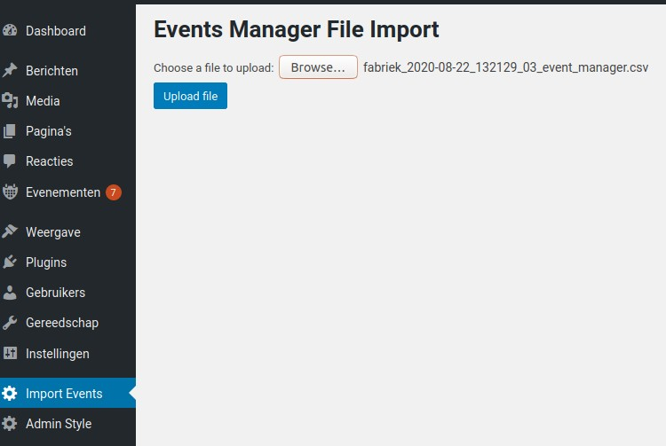
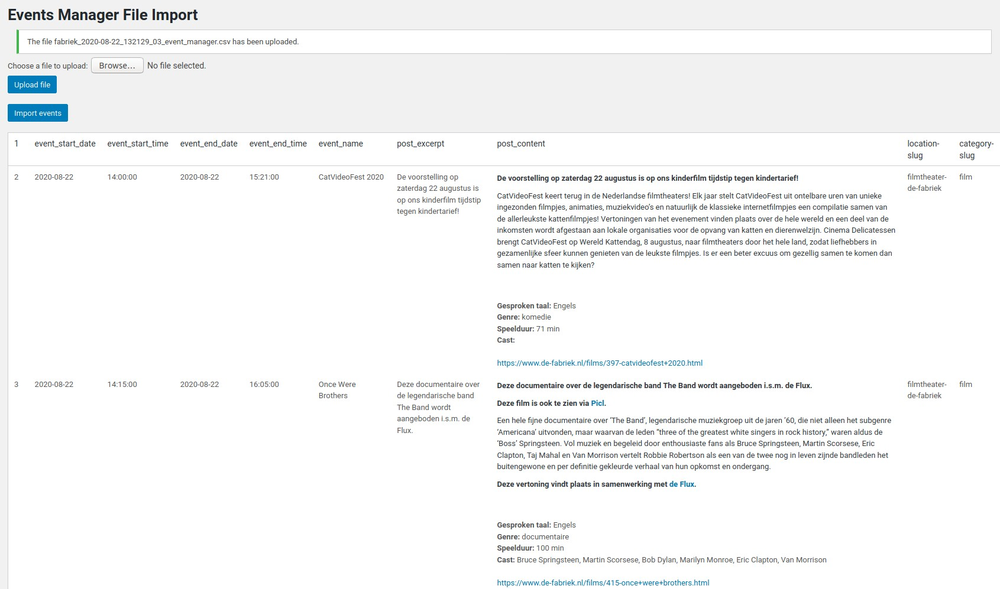
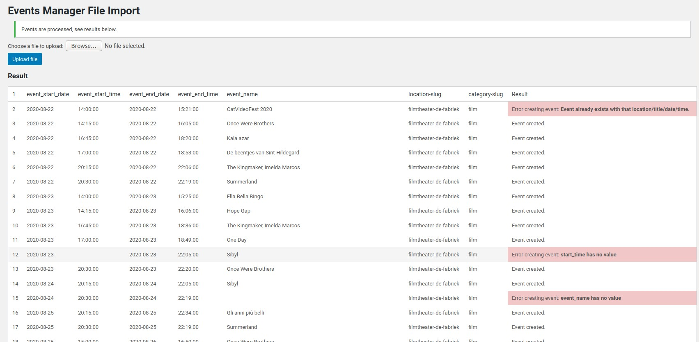

# Events Manager File Import

Plugin to upload events from a csv file into the Events Manager for Wordpress.

### Warning
This plugin is NOT created by the people of Events Manager (https://wp-events-plugin.com). 
It is created because we needed a simple but efficient csf file import function.

### Installation
As long as this plugin is not available in the Wordpress plugin repositories, install it by:
 - download this project
 - copy it to the wp-content/plugins directory
 - go to 'Plugins' in the admin menu
 - activate this plugin
 - this creates a 'EM file import' entry in the Admin menu
 
### Functionality
The user can upload a .csv file with events to be imported. Before importing the events, 
they are shown to the user. Then the user gives the command to import the data. 
The result is shown to the user after importing the events. It shows which events were
created and which ones failed with the reason.

#### Input file
A .csv file containing the following fields in this order:

Field             | Format      | Required     |
| :---------------- | :---------- | :----------- |
| event_start_date  | YYYY-MM-DD  |  yes   |
| event_start_time  | hh:mm:ss    |  yes   |
| event_end_date    | YYYY-MM-DD  |  no, if empty, start date is taken |
| event_end_time    | hh:mm:ss    |  no, if empty, start time is taken |
| event_name        | text        |  yes   |
| post_excerpt      | text        |  no    |
| post_content      | text        |  yes   |
| location-slug     | text        |  yes, must exist   | 
| category-slug     | text        |  yes, must exist  |

##### checks
1) duplicates - when an event already exists with the same location, event_name, start date and start time the event is 
not created and an error is shown in the result page.

##### Screenprints

1) Browse for csv file to upload

2) Show preview uploaded events from file

3) Show result processing the events with some errors and some successfull creations.

##### Example file
There is a file with example data in the doc directory

    
#### Author
- Eelco Aartsen
- eelco@aesset.nl
- AESSET IT - The Netherlands
- www.aesset.nl

